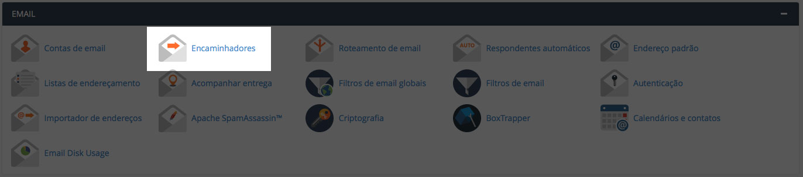
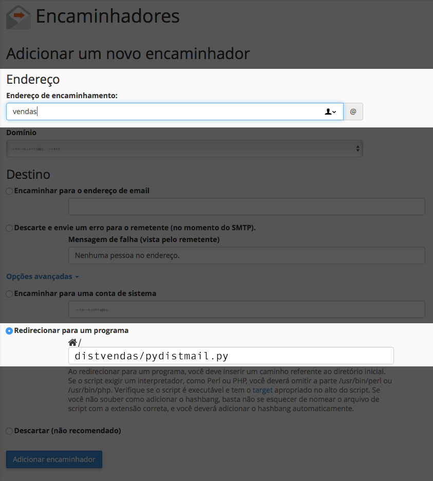

# pydistmail
Distribui os emails recebidos de forma sequencial entre membros de uma lista 
utilizando Python.

Quando usar
-----------
Imagine que você tem uma equipe de vendas e gostaria que os 
contatos recebidos em um site, seja distribuido igualmente entre os vendedores.

Como usar no cPanel
-------------------

1. Crie uma conta de email que receberá os contatos ```Ex: vendas@domain.com```
2. Crie as contas de emails para onde serão distribuidos os contatos.
3. Faça upload do script no servidor. (atenção: NÃO utilize uma pasta pública)
4. Altere os privilégios do script `$chmod 744 pydistmail.py`
5. Altere a lista de vendedores (os mesmos que criou no passo 2)

```python
# lista com vendedores ou emails para distribuição
vendedores = [('Vendedor 01', 'vendas01@dominio.com.br'),
              ('Vendedor 02', 'vendas02@dominio.com.br'),
              ('Vendedor 03', 'vendas03@dominio.com.br')]
```

6. Altere o email principal de recebimento. (o mesmo que criou no passo 1)

```python
s.sendmail("vendas@dominio.com.br", vendedores[proximovendedor][1],
           msg.as_string())
```

7. Adicione um novo encaminhamento para o email de distribuição.



8. Encaminhe para o script.




Done.

TODO:
* Melhorar a documentação
* Salvar logs de emails recebidos e distribuidos em um banco de dados
* Relatórios


